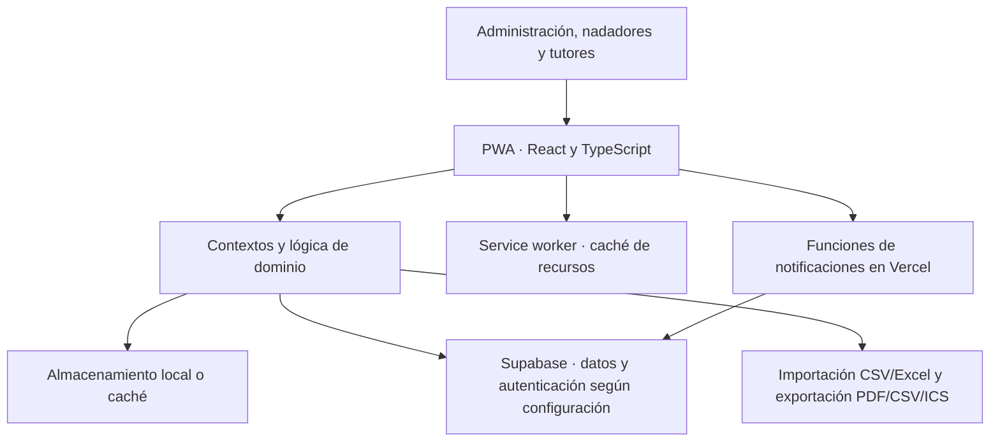

# Gestión de un club de natación
### Caso de estudio · Proyecto propio en desarrollo · Desarrollo asistido por IA

Aplicación web progresiva (PWA) que reúne tareas habituales de un club de natación: planificación, asistencia, convocatorias y seguimiento de marcas.

**Autor del proyecto:** Manuel López Serrano  
**Orientación:** aprendizaje práctico en desarrollo asistido por IA y automatización de procesos.

> Este repositorio contiene documentación pública del proyecto. El código de uso interno, las cuentas y los datos del club permanecen privados. No es una aplicación instalable ni una demo pública.

## El problema
La gestión de un club combina información con ritmos y destinatarios distintos: sesiones de entrenamiento, calendarios de competición, convocatorias, asistencia y resultados. El proyecto busca reunir esos flujos en una interfaz que se pueda consultar desde el móvil.

## Qué contiene la aplicación

| Área | Funcionalidad implementada en el código |
| --- | --- |
| Organización | Calendario, grupos, sesiones y convocatorias |
| Seguimiento | Asistencia, marcas personales y evolución |
| Datos deportivos | Importación de récords desde CSV/Excel y conversión de tiempos |
| Informes | Exportación de información a PDF, CSV y calendarios ICS |
| Perfiles | Vistas diferenciadas para administración, nadadores y tutores |
| Uso móvil | PWA, diseño adaptable, temas claro/oscuro y caché para cobertura irregular |

Estas funcionalidades se han identificado en el repositorio. Su presencia no equivale a una certificación de funcionamiento en producción.

## Mi aportación y uso de IA
Mi trabajo consiste en **definir las necesidades, pedir cambios a ChatGPT/OpenCode, probar los resultados y detectar errores**. Utilizo estos asistentes para apoyar la generación y revisión del código, entenderlo y resolver problemas.

El desarrollo es asistido por IA. Estoy aprendiendo a comprender y mantener la solución; no presento todo el código como escrito de forma independiente ni este proyecto como experiencia profesional en ingeniería de IA.

## Stack del proyecto

| Tecnología | Función en la aplicación |
| --- | --- |
| React 18 + TypeScript | Interfaz, componentes y tipos de datos |
| Vite | Desarrollo local y compilación |
| Tailwind CSS | Estilos y adaptación a distintos tamaños de pantalla |
| Supabase | Integraciones de datos, autenticación y políticas de acceso |
| Vercel | Configuración de alojamiento de la SPA y funciones de notificaciones |
| jsPDF / xlsx / ical-generator | Informes PDF, lectura de hojas de cálculo y exportación de calendarios |
| Git y GitHub | Versionado del proyecto |

Son tecnologías utilizadas en el proyecto con apoyo de IA. **No constituyen una declaración de dominio avanzado.** El proyecto usa IA como ayuda al desarrollo; no se presenta como una aplicación con un modelo de IA integrado.

## Arquitectura
Esquema elaborado a partir del código del proyecto:

Hay un modo local de pruebas y una integración de servidor que depende de la configuración y las migraciones. El esquema Prisma/SQLite del repositorio es de referencia; no es el backend utilizado por la interfaz en tiempo de ejecución.

## Un flujo de automatización existente
La importación de récords es un ejemplo concreto dentro del proyecto:

1. Seleccionar un archivo CSV o Excel.
2. Detectar columnas u hojas y normalizar formatos de fechas, pruebas y tiempos.
3. Separar los registros aceptados de los errores, indicando su ubicación.
4. Revisar el resultado en el panel antes de importarlo.

Este flujo está implementado como parte de la aplicación. No lo presento como un segundo proyecto independiente ni como un CRM terminado.

## Instalación y acceso
Este repositorio público solo contiene el caso de estudio: **no requiere instalación** y no incluye ejecutables, claves ni acceso a la aplicación interna.

En el proyecto privado, el desarrollo usa Node.js y npm: instalación desde el archivo de bloqueo, configuración de entorno y arranque con Vite. La guía detallada y las comprobaciones están en su README privado. No se publica un enlace a producción ni cuentas de acceso.

## Aprendizajes
El proyecto me sirve para trabajar en:
- Traducir necesidades del entorno deportivo a requisitos concretos.
- Dar instrucciones a asistentes de IA e iterar a partir de fallos observados.
- Entender la relación entre interfaz, almacenamiento local y servicios externos.
- Distinguir una demostración funcional de una aplicación preparada para uso real.
- Documentar el stack y el alcance sin confundir uso asistido con dominio técnico.

## Estado y próximos pasos
**En desarrollo.** La preparación para producción y la validación de permisos siguen siendo trabajo pendiente. No se publican métricas de uso, ahorro de tiempo ni resultados que no se hayan medido.

Próximos pasos: reforzar la comprensión del código, completar la validación del flujo de datos y preparar una demo aislada con datos inequívocamente ficticios.

## Capturas y privacidad
Esta versión utiliza el diagrama de arquitectura. No se han incorporado capturas de cuentas internas ni documentos, nombres o registros de deportistas. Las futuras capturas deberán proceder de una demo aislada con datos ficticios.

---
[Perfil de Manuel López Serrano](https://github.com/Malose3)
